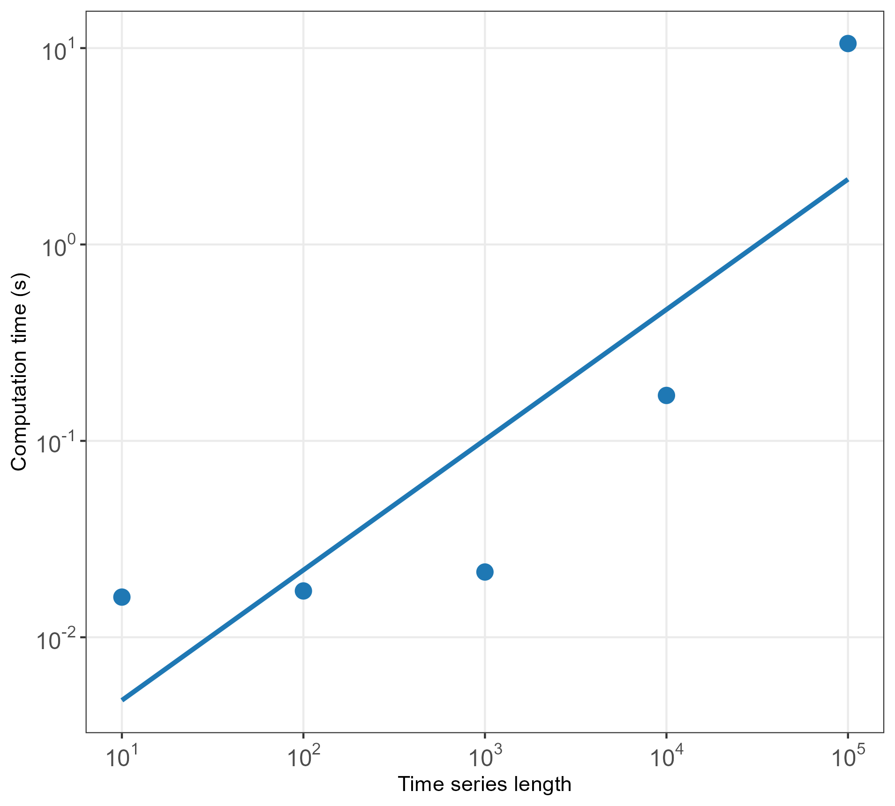

# basicproperties 

R package for the calculation of a set of very basic statistical properties of time-series data.

```{r, include = FALSE}
knitr::opts_chunk$set(
comment = NA, fig.width = 7, fig.height = 5, cache = FALSE)
```

## Installation

You can install the development version of `basicproperties` from GitHub using the following:

```{r eval = FALSE}
devtools::install_github("hendersontrent/basicproperties")
```

## Usage

`basicproperties` currently calculates $516$ features from the following domains:

* `"distribution"`---features which ignore temporal ordering and compute summary statistics of the distribution
* `"ACF"`---coefficients of the autocorrelation function up to a lag of $5$
* `"linearity"`---features associated with the linear trend of the time series
* `"quantiles"`---values for $100$ quantiles of the data
* `"fft"`---the first $100$ coefficients of the fast Fourier transform, including their real, imaginary, absolute, and angle components, as per the [`tsfresh`](https://github.com/blue-yonder/tsfresh/) package for Python

Users can compute all the features in `basicproperties` at once using the main function `get_properties`. This can be run in a one-liner as it only takes an input vector as an argument. Here is a demonstration on a vector of $T = 1000$ samples generated from an AR(1) process:

```{r, message = FALSE, warning = FALSE}
library(basicproperties)
y <- arima.sim(model = list(ar = 0.8), n = 1000)
outs <- get_properties(y)
```

Here is a sample of twenty of the features:

```{r, message = FALSE, warning = FALSE, echo = FALSE}
head(outs, n = 20)
```

## Computational performance

`basicproperties` is highly computationally efficient, scaling nearly linearly with time-series size. Computation time in seconds for a range of time series lengths is presented below.


