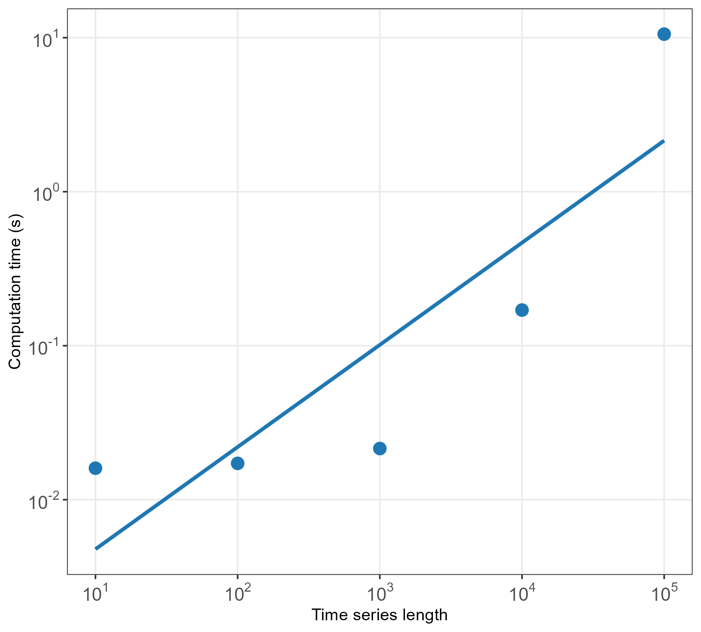

  
```{r, include = FALSE}
knitr::opts_chunk$set(
  collapse = TRUE,
  comment = "#>",
  fig.height = 7,
  fig.width = 7,
  warning = FALSE,
  fig.align = "center"
)
```

```{r setup, message = FALSE, warning = FALSE}
library(basicproperties)
```

## Purpose

`basicproperties` is an R package for the calculation of a set of very basic statistical properties of time-series data. It is the intention that these be used as a form of measurement against which more complex time-series feature sets or individual features can be compared. This ensures that complexity is added only when warranted.

## Usage

Users can compute all the features in `basicproperties` at once using the main function `get_properties`. This can be run in a one-liner as it only takes an input vector as an argument. Here is a demonstration on a vector of $T = 1000$ samples generated from an AR(1) process:

```{r, message = FALSE, warning = FALSE}
y <- arima.sim(model = list(ar = 0.8), n = 1000)
outs <- get_properties(y)
head(outs)
```

## Computational performance

`basicproperties` is highly computationally efficient, scaling nearly linearly with time-series size. Computation time in seconds for a range of time series lengths is presented below.


